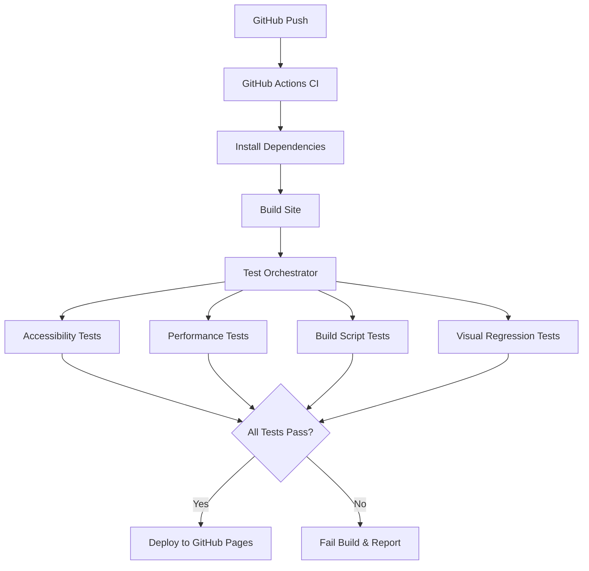

# Design Document

## Overview

The automated testing suite will be implemented as a modular system that integrates seamlessly with the existing Node.js build pipeline and GitHub Actions CI/CD workflow. The design prioritizes incremental implementation, allowing each testing component to be added independently while maintaining a consistent configuration and reporting interface.

The testing suite will leverage industry-standard tools and follow the project's existing architectural principles of simplicity, performance, and maintainability.

## Architecture

### High-Level Architecture



### Testing Framework Structure

The testing suite will be organized into distinct modules:

```
tests/
├── config/
│   ├── test-config.js          # Centralized test configuration
│   ├── lighthouse-config.js    # Lighthouse audit configuration
│   └── visual-config.js        # Visual regression thresholds
├── accessibility/
│   ├── a11y.test.js           # Accessibility test suite
│   └── helpers/
│       └── axe-setup.js       # Axe-core configuration
├── performance/
│   ├── lighthouse.test.js     # Performance audit tests
│   └── helpers/
│       └── lighthouse-setup.js
├── build/
│   ├── build-script.test.js   # Build script unit tests
│   └── fixtures/              # Test fixtures and mock data
├── visual/
│   ├── visual-regression.test.js
│   └── screenshots/
│       ├── baseline/          # Reference screenshots
│       └── current/           # Current test screenshots
└── utils/
    ├── test-server.js         # Local test server utilities
    └── report-generator.js    # Test report formatting
```

## Components and Interfaces

### 1. Test Orchestrator

**Purpose:** Central coordinator that manages test execution order and configuration loading.

**Key Functions:**

- Load and validate test configuration
- Coordinate test execution based on enabled modules
- Aggregate test results and generate unified reports
- Handle test server lifecycle for browser-based tests

**Interface:**

```javascript
class TestOrchestrator {
  constructor(config) {
    /* Load configuration */
  }
  async runAllTests() {
    /* Execute enabled test suites */
  }
  async generateReport() {
    /* Create unified test report */
  }
}
```

### 2. Accessibility Testing Module

**Purpose:** Automated WCAG compliance verification using axe-core.

**Key Features:**

- Tests both light and dark themes
- Configurable WCAG level enforcement (A, AA, AAA)
- Detailed violation reporting with remediation suggestions
- Integration with Puppeteer for browser automation

**Configuration Options:**

```javascript
accessibility: {
  enabled: true,
  wcagLevel: ['wcag2a', 'wcag2aa'],
  testBothThemes: true,
  excludeRules: [], // Optional rules to skip
  timeout: 30000
}
```

### 3. Performance Testing Module

**Purpose:** Lighthouse-based performance auditing with configurable budgets.

**Key Features:**

- Configurable performance budgets for each Lighthouse category
- Mobile and desktop testing
- Performance trend tracking
- Integration with Lighthouse CI for detailed reporting

**Configuration Options:**

```javascript
performance: {
  enabled: true,
  budgets: {
    performance: 95,
    accessibility: 100,
    bestPractices: 95,
    seo: 95
  },
  testMobile: true,
  testDesktop: true
}
```

### 4. Build Script Testing Module

**Purpose:** Unit tests for the custom build script functionality.

**Key Features:**

- File generation verification
- Asset minification validation
- Sitemap date updating verification
- Favicon processing validation

**Test Categories:**

- File system operations (directory creation, file copying)
- Asset processing (minification, optimization)
- Template rendering and content injection
- Configuration handling

### 5. Visual Regression Testing Module

**Purpose:** Screenshot-based visual change detection using Playwright.

**Key Features:**

- Baseline screenshot management
- Configurable pixel difference thresholds
- Multi-theme screenshot comparison
- Responsive breakpoint testing

**Configuration Options:**

```javascript
visual: {
  enabled: true,
  threshold: 0.2, // Pixel difference threshold (0-1)
  updateBaseline: false, // Set to true to update reference images
  viewports: [
    { width: 1920, height: 1080 },
    { width: 768, height: 1024 }
  ]
}
```

## Data Models

### Test Configuration Schema

```javascript
const testConfig = {
  // Global settings
  global: {
    testTimeout: 30000,
    distDirectory: './dist',
    baseUrl: 'http://localhost:3000',
    reportDirectory: './test-reports',
  },

  // Module-specific configurations
  accessibility: {
    /* ... */
  },
  performance: {
    /* ... */
  },
  build: {
    /* ... */
  },
  visual: {
    /* ... */
  },
};
```

### Test Result Schema

```javascript
const testResult = {
  module: 'accessibility',
  status: 'passed' | 'failed' | 'skipped',
  duration: 1234, // milliseconds
  details: {
    testsRun: 5,
    testsPassed: 5,
    testsFailed: 0,
    violations: [], // Detailed failure information
    recommendations: [], // Suggested fixes
  },
  timestamp: '2025-01-09T10:30:00Z',
};
```

## Error Handling

### Test Failure Scenarios

1. **Accessibility Violations:** Detailed violation reports with element selectors and remediation guidance
2. **Performance Budget Failures:** Specific metric failures with optimization recommendations
3. **Build Script Failures:** File system and processing error details
4. **Visual Regression Failures:** Side-by-side image comparisons with difference highlighting

### Error Recovery Strategies

- **Graceful Degradation:** Individual test module failures don't prevent other modules from running
- **Retry Logic:** Transient failures (network issues, browser crashes) trigger automatic retries
- **Detailed Logging:** Comprehensive error logging for debugging failed tests
- **CI Integration:** Clear failure reporting in GitHub Actions with actionable error messages

## Testing Strategy

### Test Execution Flow

1. **Pre-Test Setup:**
   - Start local test server serving built files
   - Load and validate test configuration
   - Initialize browser instances for browser-based tests

2. **Test Execution:**
   - Run tests in parallel where possible (accessibility + performance)
   - Execute build script tests independently
   - Run visual regression tests last (to avoid interference)

3. **Post-Test Cleanup:**
   - Generate unified test report
   - Clean up temporary files and browser instances
   - Upload test artifacts (screenshots, reports) to CI

### Incremental Implementation Strategy

**Phase 1: Foundation**

- Test orchestrator and configuration system
- Build script unit tests
- Basic CI integration

**Phase 2: Browser Testing**

- Accessibility testing with axe-core
- Basic performance testing with Lighthouse

**Phase 3: Advanced Features**

- Visual regression testing
- Performance budgeting and trend tracking
- Enhanced reporting and notifications

### Integration with Existing Workflow

The testing suite will integrate into the existing GitHub Actions workflow by adding a new step between "Build project" and "Upload artifact":

```yaml
- name: Build project
  run: npm run build

- name: Run Test Suite
  run: npm run test:all
  env:
    CI: true

- name: Upload Test Reports
  uses: actions/upload-artifact@v3
  if: always()
  with:
    name: test-reports
    path: test-reports/

- name: Upload artifact
  uses: actions/upload-pages-artifact@v3
  with:
    path: './dist'
```

This design ensures that the testing suite enhances the existing workflow without disrupting the established build and deployment process.
